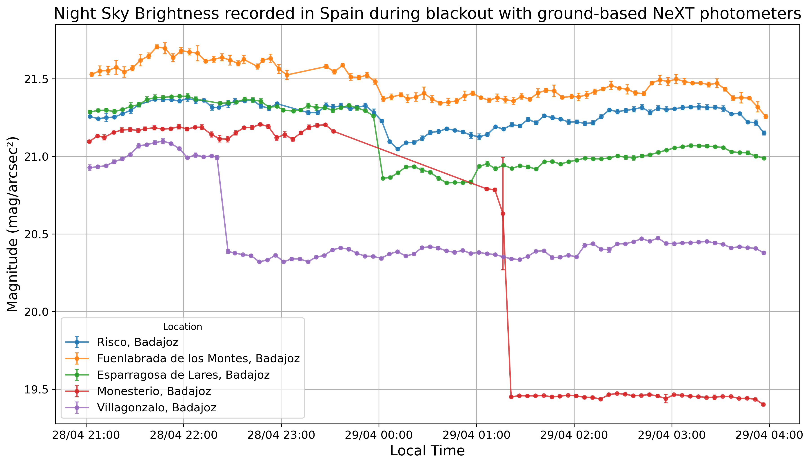

<h1>Night Sky Brightness Analysis During the Spain–Portugal Blackout (28–29 April 2025)</h1>

This project investigates variations in night sky brightness recorded by a network of ground-based photometers during the large-scale electrical blackout that affected Spain and Portugal on 28–29 April 2025.

The analysis combines photometer measurements, geospatial filtering, time-series processing, and visualization to study the impact of artificial light reduction on observed sky brightness.

<h2>Features</h2>

<ul>
    <li>InfluxDB data retrieval</li>
    <li>Photometer selection and location matching</li>
    <li>Geographical filtering</li>
    <li>Time-series processing with Pandas</li>
    <li>Cloudlessness filtering</li>
    <li>Night sky brightness visualization</li>
</ul>

<h2>Workflow</h2>

<pre>
InfluxDB
    ↓
Photometer Selection
    ↓
Location Filtering
    ↓
Measurement Retrieval
    ↓
Quality Filtering
    ↓
Visualization
</pre>

<h2>Final Result</h2>

  

  <em>Night sky brightness measurements recorded during the blackout event.</em>

<h2>Requirements</h2>

<ul>
    <li>Python 3.9+</li>
    <li>Pandas</li>
    <li>InfluxDB</li>
    <li>Matplotlib</li>
    <li>python-dotenv</li>
    <li>pytz</li>
</ul>
